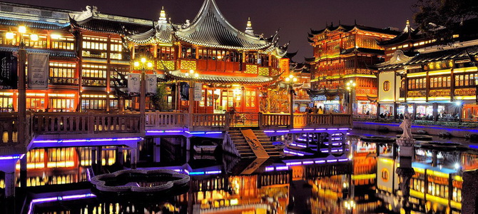
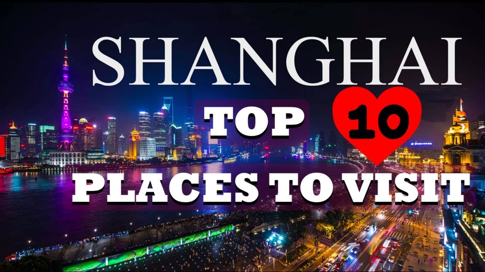

# 关于我和上海 (Guan Yu Wo He ShangHai) (About Me and ShangHai）

Yu Garden Of Shang Hai ^^^^

[老师好大家好。](https://www.helloeveryone.studio/) [我要自我介绍。](https://notascaredycat.wordpress.com/2014/05/06/allow-me-to-introduce-myself/) [我的名字是产款物。](https://www.thoughtco.com/what-to-know-about-german-names-1444327). [我的岁是十九。](http://www.sohu.com/a/136143692_639367) [我不有朋友。](https://www.pinterest.com/pin/312789136602685460/).[ 我的朋友不喜欢我。](http://smszoo.com/hate-poems-friends-cheating-betrayal-friendship.html) [我的家有我的妈妈](https://www.pinclipart.com/pindetail/biRJTi_graphic-library-stock-2017-drawing-mothers-day-happy/)，[爸爸](https://www.history.com/topics/holidays/fathers-day)，[弟弟](https://en.wikipedia.org/wiki/Little_Brother_(group))，和[妹妹](http://www.dinelittlesister.com/)。[我喜欢睡觉。](https://www.clipartwiki.com/iclip/bwoTo_sleep-icon-clipart-sleep-icon/)我也喜欢吃[饺子](https://eatnorth.com/diana-ng/chinese-napa-cabbage-and-pork-dumplings-jiaozi)和[炒饭](https://www.google.com/search?q=chao+fan&tbm=isch&ved=2ahUKEwirxuen4aDlAhUWVFkKHdtzCIwQ2-cCegQIABAA&oq=chao+fan&gs_l=img.3..0l10.28820.29790..30020...0.0..0.73.508.8......0....1..gws-wiz-img.......35i39j0i67j0i131j0i3j0i10.SozGYeNeJb4&ei=TQqnXevrMZao5QLb56HgCA&bih=864&biw=1280&rlz=1C1CHBF_enUS853US870&safe=strict#imgrc=2eQcXCy3ZFmMVM)。我喜欢喝[可乐](https://www.walmart.com/ip/Coca-Cola-Classic-Soda-3L/16777273)。

Hello everyone, I am going to introduce you about myself. My name is Danny Tran (Chan Kuan Wu). I have no friends. My friends doesn't like me. In my family there are my mother, father, little brother and little sister. I like to eat dumplings and my favorite drink is soda coca cola.

# 参观的地点 （Cānguān dì dìdiǎn) (Places to visit)

1)[The Bund](https://travel.usnews.com/Shanghai_China/Things_To_Do/The_Bund_62575/)

2)[Shanghai Museum](https://travel.usnews.com/Shanghai_China/Things_To_Do/Shanghai_Museum_62573/)

3)[Zhujiajiao](https://travel.usnews.com/Shanghai_China/Things_To_Do/Shanghai_Museum_62573/)

4)[Shanghai World Financial Center](https://travel.usnews.com/Shanghai_China/Things_To_Do/Shanghai_World_Financial_Center_62571/)

5)[Yuyuan Garden](https://travel.usnews.com/Shanghai_China/Things_To_Do/Yuyuan_Garden_62576/)

6)[Longhua Temple](https://travel.usnews.com/Shanghai_China/Things_To_Do/Longhua_Temple_62586/)

7)[Jade Buddha Temple](https://travel.usnews.com/Shanghai_China/Things_To_Do/Jade_Buddha_Temple_62585/)

8)[Shanghai Maglev](https://travel.usnews.com/Shanghai_China/Things_To_Do/Shanghai_Maglev_62577/)

9)[Oriental Pearl TV Tower](https://travel.usnews.com/Shanghai_China/Things_To_Do/Oriental_Pearl_TV_Tower_62572/0)

10)[Nanjing Road](https://travel.usnews.com/Shanghai_China/Things_To_Do/Nanjing_Road_62574/)

#THE BUND

*Shanghai's picturesque waterfront, known as "the Bund," is where you'll find those classic skyline photo ops.
*Such as the Oriental pearl TV Tower, the Shanghair World Fanancial Center and other skyscrapers standing across the Huangou River.

https://travel.usnews.com/Shanghai_China/Things_To_Do/The_Bund_62575/
